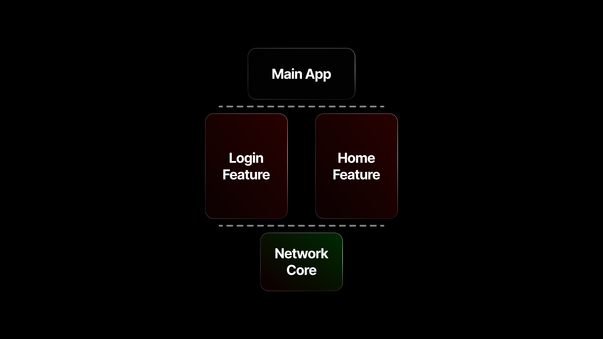
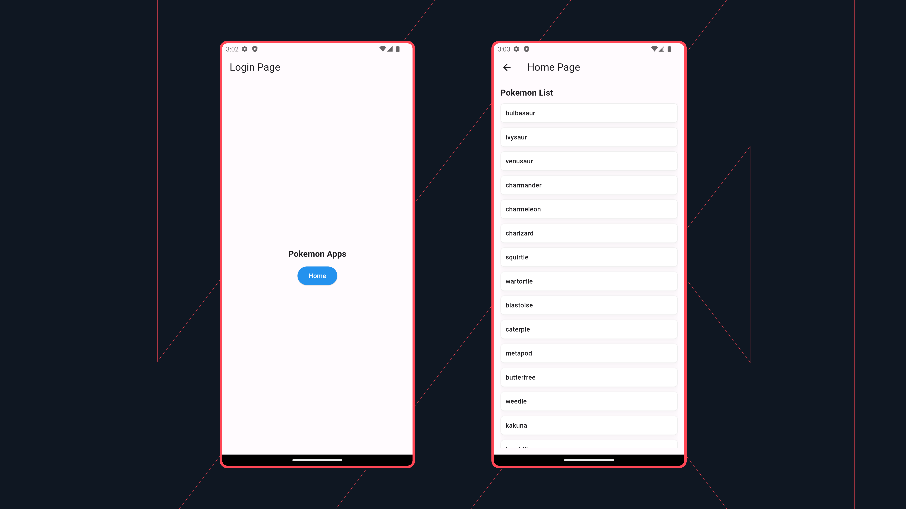

# Flutter Modularization Example

An example of a modularized Flutter app. Check it out on my [blog](https://rizaadikurniawan.com/blog/modularization-flutter) for details.

## Layer



## Screenshot



## Getting Started

1. Clone the repo

   ```sh
   git clone https://github.com/rizaadi/flutter-modularization-example.git

   cd flutter_modularization_example
   ```

2. Install NPM packages

   ```sh
   dart pub global activate melos
   ```

3. Bootstrap the Project with Melos and fetch dependencies

   ```sh
   melos bootstrap
   ```

4. Running the App

   ```sh
   flutter run
   ```
